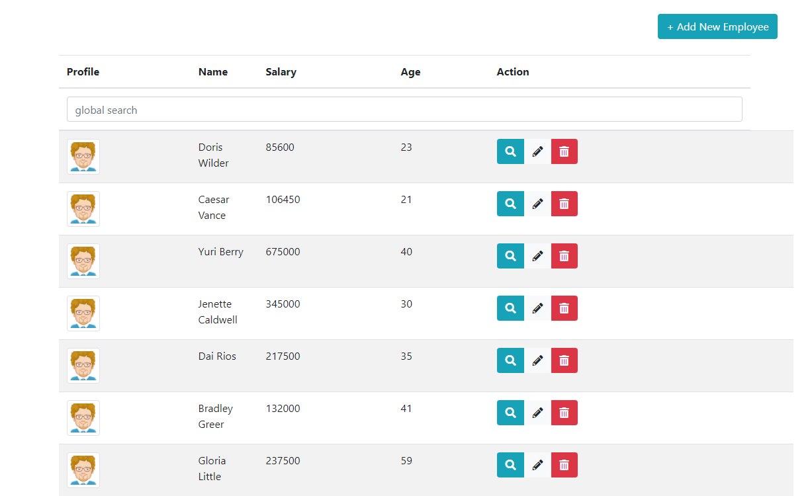
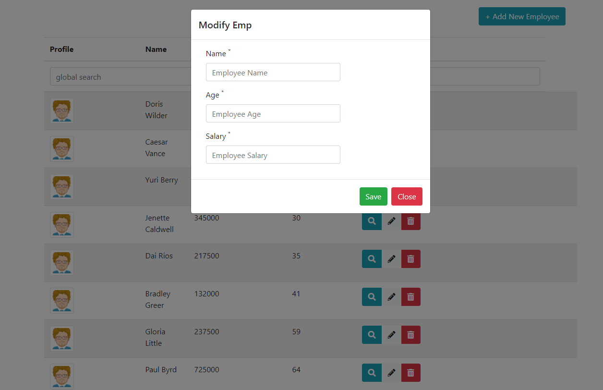
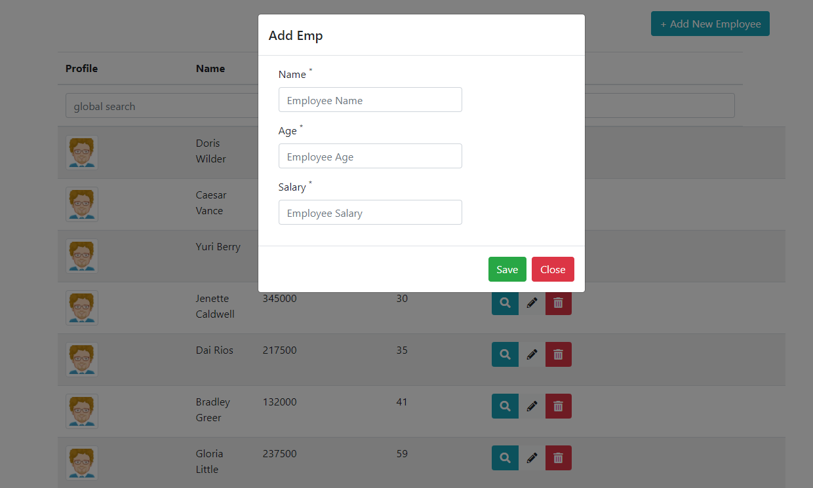

# Human Resources API

##### API REST corporativa para gestionar nuestra base de datos de empleados.

Bienvenido, joven programador! Nuestro equipo de back-end ha creado esta API para ayudarnos a controlar los registros de los empleados de la empresa. 

La URL base de nuestra API es la siguiente: 

https://proxy-neoland.ga

Para poder usar la API tendrás que hacer una llamada HTTP al endpoint que toque. Los endpoints se forman uniendo la URL base + el path que quieras utilizar.

Ejemplo: https://proxy-neoland.ga/users

(ver los paths disponibles más abajo)

De cada empleado se guarda la siguiente información:

- FirstName
- SecondName
- Departamento
- Salario
- id (este último dato se genera automáticamente en nuestro back-end)

##### ¿Cómo usar la API?

La API dispone de 5 paths, que se corresponden con las operaciones CRUD:

- Una llamada GET al path `/users` devuelve la información de todos los empleados de la base de datos.

- Una llamada GET al path `/user/:id` devuelve información sobre un empleado (aquel cuyo "id" sea igual al valor que se coloque en el path param `:id`)

- Una llamada POST al path `/users` permite registrar un nuevo empleado en la base de datos. Para poder hacerlo, debes enviar en el body de la petición la siguiente información <strong>en formato JSON</strong>:

```json
{
    "FirstName": "Nombre del emplado", 
    "SecondName": "Apellidos del empleado", 
    "Departamento":"Departamento en el que trabaja", 
    "Salario":"Salario. Debe ser un número" 
}
```

- Una llamada PUT al path `/users` permite editar la información de un empleado ya registrado previamente en la base de datos. Para ello, debes enviar en el body de la petición un JSON como el que se indica en la petición POST de más arriba, pero además se le debe añadir un dato extra: el `id` del empleado que deseas editar:

```json
{
    "FirstName": "Nombre del emplado", 
    "SecondName": "Apellidos del empleado", 
    "Departamento":"Departamento en el que trabaja", 
    "Salario":"Salario. Debe ser un número", 
    "id": "ID del empleado. Debe ser un número"
}
```

- Una llamada DELETE al path `/user/:id` permite borrar un empleado de la base de datos (aquel cuyo "id" sea igual al valor que se coloque en el path param `:id` del path)

## Objetivo:

Con ayuda de esta API, vais a tener que hacer una web que permita controlar el registro de los empleados. Vuestra web debe tener el siguiente aspecto:



En cada fila se muestra la información de cada empleado. En cada fila hay también 3 botones:

- El botón de lupa deberá mostrar un modal con la información solamente de ese empleado.

- El botón del lápiz deberá mostrar un modal con un formulario, en donde se podrá editar la información del empleado.



- El botón de la papelera deberá hacer una llamada DELETE a la API para borrar ese empleado.

Cuando se haga click en el botón "Add new employee" deberá desplegarse un modal con un formulario como éste:



Al hacerse click sobre el botón "Save" se debe hacer una llamada POST al endpoint para que se guarde este nuevo empleado.

